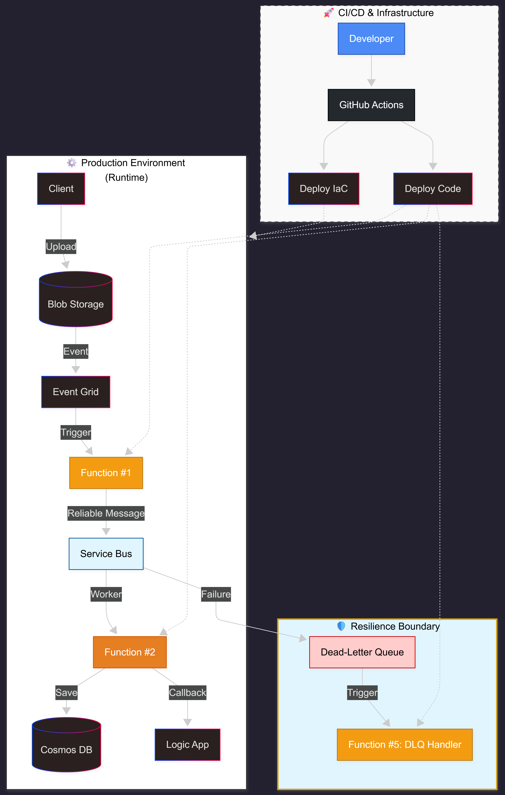

---

## 🏗️ Technical Architecture Deep Dive

_A granular analysis of the architectural decisions, component responsibilities, and the "Senior Rationale" behind the FinSolve IDP pipeline._

> [!TIP]
> **System Visualization:** The diagram below illustrates the reactive flow of the pipeline, highlighting the separation between ingestion, orchestration, and heavy processing.

### Event-Driven Document Processing Pipeline

---

### 1. The Ingestion Layer
**Azure Event Grid (The Push Model)**
* **Responsibility:** Monitors the Blob Storage container and routes `BlobCreated` events to Function #1.
* **Senior Rationale:** We avoided the standard BlobTrigger (polling-based) to eliminate unnecessary execution costs. Event Grid ensures the system is 100% reactive, scaling to zero when idle.

**Function #1: Metadata & Validation**
* **Responsibility:** Validates file types (PDF, Txt, Docx, CSV, JSON), checks size constraints, and calculates a SHA-256 hash.
* **Senior Rationale:** By calculating a hash early, we implement **Idempotency**. If the same file is uploaded twice, the system detects the hash in the database and terminates the process before expensive "Heavy Processing" begins.

---

### 2. The Orchestration & Messaging Layer
**Azure Service Bus (The Load Leveler)**
* **Responsibility:** Acts as a persistent, managed buffer between ingestion and processing.
* **Senior Rationale:** This prevents "Function Overload." If 1,000 documents are uploaded simultaneously, Service Bus queues them, allowing Function #2 to process them at a controlled rate without hitting API rate limits or blowing the budget.

---

### 3. The Processing & Persistence Layer
**Function #2: Heavy Document Processing**
* **Responsibility:** Performs the actual business logic: parsing, data extraction, and mapping to the domain model.
* **Senior Rationale:** This function is stateless and isolated. By separating "Heavy Work" from "Validation," we can scale or update the extraction logic without affecting the ingestion speed.

**Cosmos DB / SQL Serverless**
* **Responsibility:** Stores the processed results and metadata.
* **Senior Rationale:** We chose Serverless/Consumption tiers to ensure that storage costs align perfectly with the "Pay-per-use" philosophy of the project.

---

### 4. Resilience & Utility
**Function #5: DLQ Handler (Dead-Letter Queue)**
* **Responsibility:** Monitors the Service Bus Dead-Letter Queue for messages that failed all retry attempts.
* **Senior Rationale:** Junior developers often forget the "Failure Path." This handler provides observability into varför ett dokument misslyckades, triggers notifications via Logic Apps, and allows for manual intervention.

**Logic Apps: The Integration Glue**
* **Responsibility:** Handles external notifications (Email/Teams) and simple workflow orchestration.
* **Senior Rationale:** We use Logic Apps for integration, not heavy logic. This minimizes "billable actions" while providing a low-code way to manage complex notification chains.

> [!NOTE]
> Every component in this architecture is chosen to support a **FinOps-first** approach, ensuring that costs are only incurred when value (document processing) is being generated.
