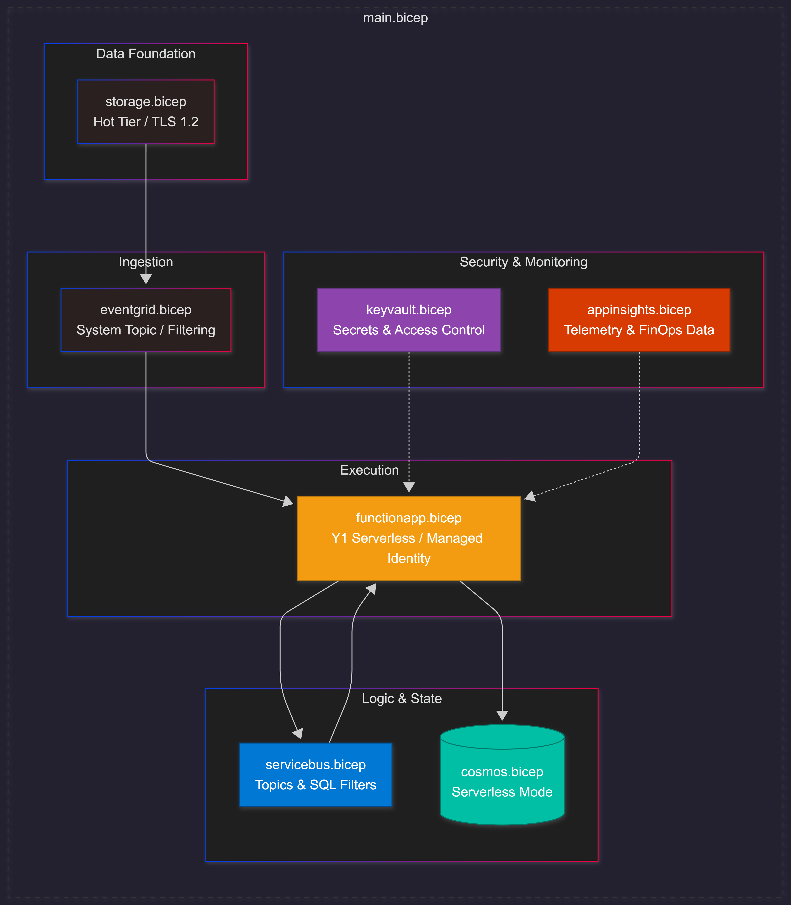

---

## 🛠️ Infrastructure as Code Specification

_A detailed breakdown of the 7-layer modular Bicep architecture used to provision the FinSolve IDP ecosystem._

> [!TIP]
> **IaC Strategy:** By utilizing a modular Bicep design, we ensure 100% environment parity and eliminate "configuration drift." Each layer is decoupled, allowing for independent scaling and maintenance of the cloud resources.

### Resource Dependency & Module Graph

---

### 1. Compute Layer (`functionapp.bicep`)
The heart of the system, configured for high security and performance.
* **Resource Plan:** Utilizes the **Y1 Dynamic tier** (Serverless Consumption) to align perfectly with FinOps goals.
* **Identity-Driven Security:** Uses **System-Assigned Managed Identity** to eliminate the need for hardcoded connection strings in application settings.
* **Runtime:** Built for **.NET Isolated**, providing a clean architectural separation between the function host and the application code.

---

### 2. Messaging Layer (`servicebus.bicep`)
Handles the asynchronous orchestration and reliable delivery of document events.
* **Topic-Based Routing:** Uses a single topic (`idp-documents`) with specific **SQL Filters** for fine-grained message routing (e.g., `sys.Label = 'MetadataValidated'`).
* **Resiliency:** Configured with a `maxDeliveryCount` of 5 and `deadLetteringOnMessageExpiration` to ensure no data is lost during transient failures.

---

### 3. Data Persistence (`cosmos.bicep`)
Stores document state and processing results with enterprise-grade consistency.
* **Serverless Mode:** Explicitly enabled to ensure **zero costs** during idle periods.
* **Multi-Container Design:** Segregates data into specialized containers: `processingResults`, `documentStatus`, and a dedicated store for system observability.

---

### 4. Ingestion & Eventing (`eventgrid.bicep`)
The reactive entry point for the entire pipeline.
* **System Topic:** Configured for `Microsoft.Storage.StorageAccounts` to listen for new file uploads.
* **Granular Filtering:** Only triggers for `BlobCreated` events within the specific `/blobs/documents/` path, preventing unnecessary and costly function executions.

---

### 5. Secure Storage (`storage.bicep`)
The foundation for raw data and internal function state.
* **Security Hardening:** Enforces **TLS 1.2** and strictly disables `allowBlobPublicAccess`.
* **Hot Tier:** Optimized for low-latency access to active document uploads.

---

### 6. Secrets Management (`keyvault.bicep`)
Centralized security for any non-identity-based credentials.
* **Protection:** Features `enableSoftDelete` and `enablePurgeProtection` to prevent accidental loss of critical security assets.
* **RBAC Ready:** Deploys favoring **Azure RBAC** for more granular and modern access control compared to legacy access policies.

---

### 7. Observability Layer (`appinsights.bicep`)
Provides the "Deep Lens" into system performance and cost.
* **Application Type:** Configured as `web` to support the distributed tracing requirements of an event-driven Function App.
* **Telemetry:** Acts as the primary data source for monitoring system health and providing data for **FinOps cost-allocation**.

> [!NOTE]
> All modules follow the **Principle of Least Privilege**, ensuring that each resource only has the specific permissions required to perform its designated task within the pipeline.
